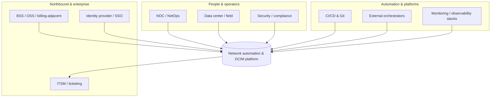
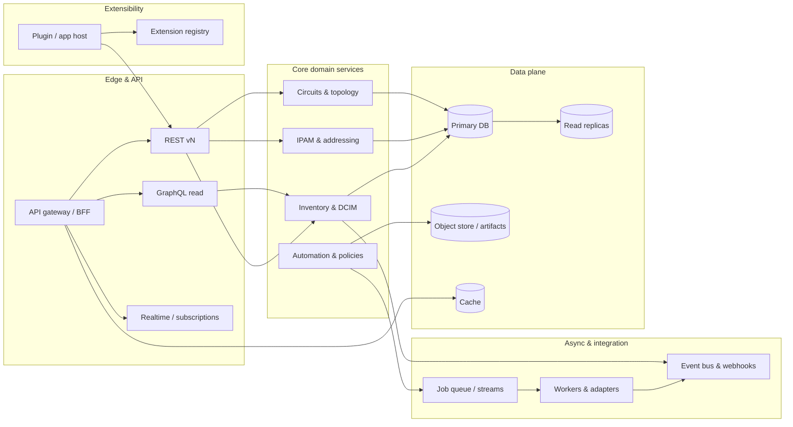
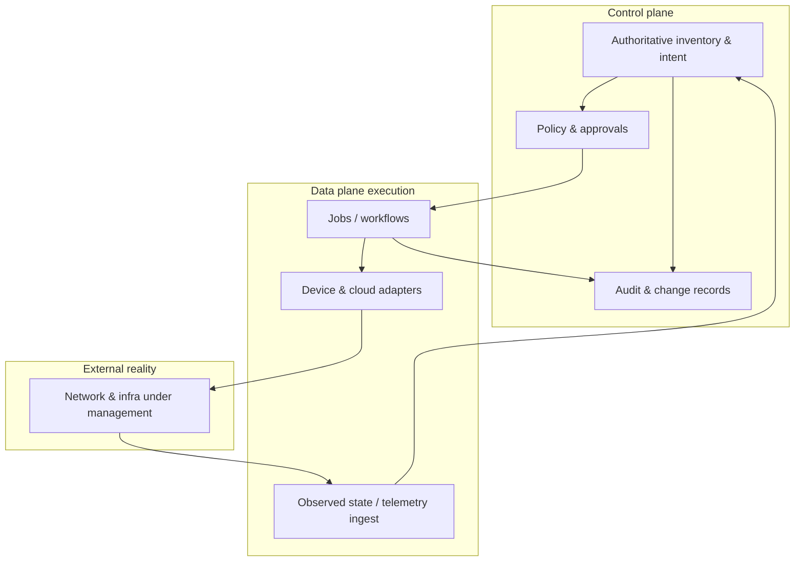
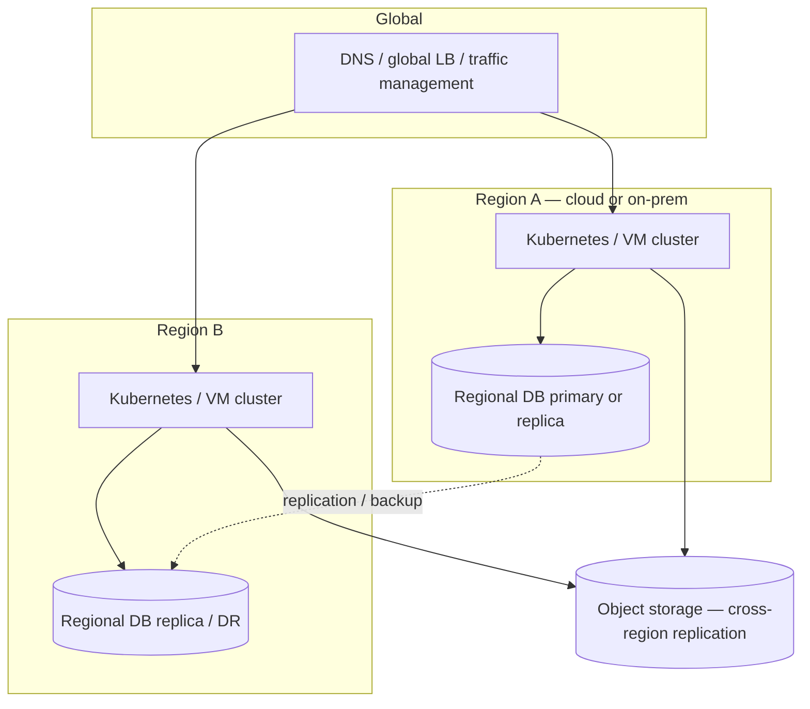
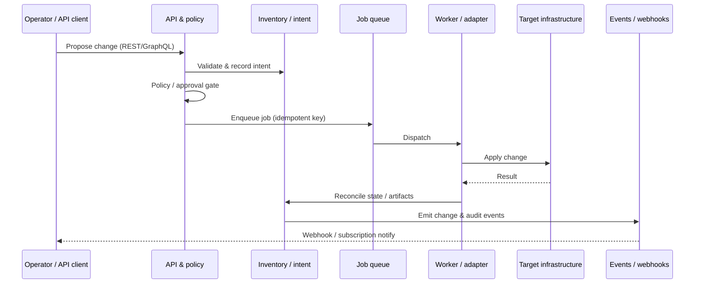
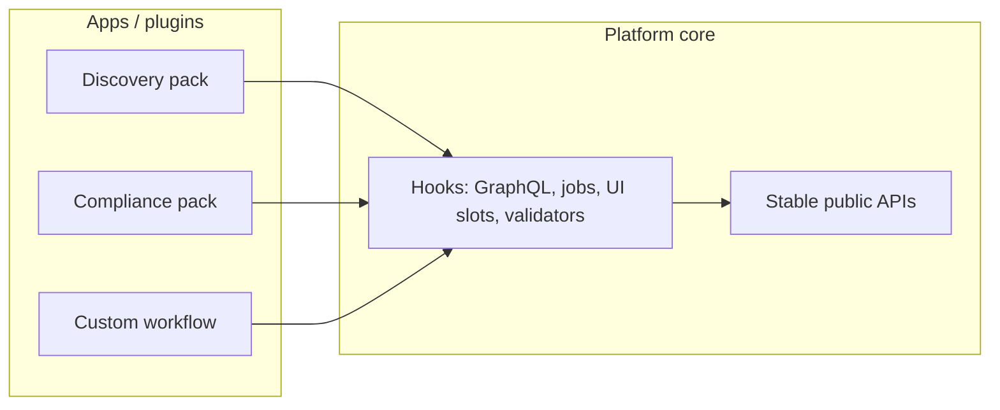

# Architecture & design visuals

This document expands the [README](../README.md) with diagrams you can maintain as the platform design evolves. Diagrams use [Mermaid](https://mermaid.js.org/), which renders on GitHub. Content here describes the **target** architecture (multi-region, queues, plugin registry, etc.); the running code under `platform/` may not implement every box yet—see the root README **Implementation status** note.

---

## 1. System context (who connects to what)

Provider-scale operators, internal teams, and machines interact with the platform; northbound systems consume intent and events.

---

## 2. Logical containers (runtime view)

Stateless edge, core services, durable data, async work, and plugin workloads are separated so each tier can scale and fail independently.

---

## 3. Control plane vs data plane (mental model)

**Intent** (what should be true) is stored and audited in the control plane; **automation** applies changes and reconciles observed state without collapsing those concerns.

---

## 4. Multi-region / multi-cloud deployment (reference pattern)

A typical **active/active or active/passive** layout: global routing, regional clusters, replicated data with explicit RPO/RTO.

---

## 5. Sequence: change request through safe automation

Illustrates **approval**, **idempotent** job execution, and **event** fan-out to integrations.

---

## 6. Plugin & app boundary

Plugins extend the UI, APIs, jobs, and validations without forking core—contracts stay versioned.

---

## Diagram maintenance

- Keep diagrams **technology-agnostic** until ADRs lock specific products.
- When stack choices land, add a **deployment diagram** folder (e.g. `docs/diagrams/`) with rendered PNG/SVG exports for slide decks if needed.
- Prefer **one diagram per concern** (context vs containers vs deployment) to avoid unmaintainable mega-charts.
