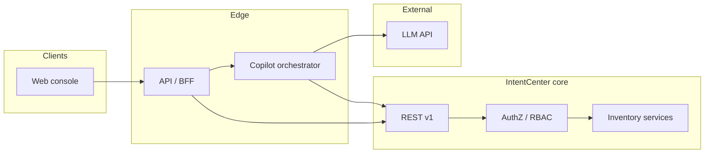

# Design: LLM-assisted operations (IntentCenter)

**Status:** Draft  
**Last updated:** 2026-04-20  
**Related:** [Architecture & design visuals](architecture.md), [Platform README](../platform/README.md)

---

## 1. Summary

This document specifies an **LLM-assisted layer** on IntentCenter: grounded answers, draft change bundles, and import/reconciliation help—without making the model a second source of truth. The assistant **reads** inventory and policy through existing APIs (and future tool endpoints), **proposes** structured actions, and **executes writes** only through the same paths as human operators (with audit, RBAC, and explicit approval where required).

---

## 2. Goals

| Goal | User-visible outcome |
|------|----------------------|
| **Throughput** | Faster path from natural-language intent to validated API payloads, bulk mappings, and runbooks. |
| **Trust** | Answers cite inventory objects and links; “unknown” is explicit when data is missing. |
| **Safety** | No silent database writes; destructive or privileged actions require the same gates as the UI/API today. |
| **Operability** | Observable, rate-limited, tenant-scoped usage suitable for production NetOps/DCIM teams. |

---

## 3. Non-goals (initial phases)

- Replacing deterministic policy engines, validation rules, or compliance checks with model judgment.
- **Unrestricted** autonomous remediation in production (no “fix it” without human or policy approval).
- Training a bespoke foundation model; **inference via hosted or self-hosted APIs** is assumed unless a later phase requires otherwise.
- Storing full customer topologies in an external vector DB **without** explicit product decision on data residency and retention (see §8).

---

## 4. Personas and primary scenarios

| Persona | Scenario | Assistant role |
|---------|----------|------------------|
| **NetOps / NOC** | “What depends on this device?” / incident context | Retrieve related objects via search + resource graph; summarize with citations. |
| **DCIM / field** | Plan a rack or maintenance window | Draft a **change bundle** (affected objects, suggested field updates); highlight conflicts. |
| **Automation engineer** | Encode a recurring procedure | Draft structured steps, variables, and guardrails for jobs/plugins (human edits). |
| **Data steward** | Reconcile vendor export to inventory | Propose **column → schema** mapping and preview for bulk CSV/JSON import. |
| **New operator** | Learn object model in context | Explain **this** record and links using retrieved fields, not generic DCIM lecture. |

---

## 5. Functional requirements

### 5.1 Grounded Q&A (read path)

- Accept user questions with optional **page context** (current `resourceType`, `id`, route).
- Retrieve evidence using server-side tools: at minimum **`GET /v1/search`**, **`GET /v1/resource-view/{resourceType}/{id}`**, **`GET /v1/resource-graph/{resourceType}/{id}`** (see [platform README](../platform/README.md)).
- Respond with **short answer + citations** (object type, id, display fields, deep link path pattern).
- If evidence is insufficient, say so and suggest **specific** follow-up queries or UI navigation—not invented IDs.

### 5.2 Change assistance (write path, proposal-first)

- From natural language or structured selection, produce a **machine-readable proposal**: list of operations (create/update/archive), target ids, field deltas, and dependency notes.
- **Preview** in UI (diff/table); execution uses **existing mutating APIs** (not direct SQL or hidden ORM bypass).
- Respect **RBAC**: proposals are generated with the **same user identity** as the session; attempted operations beyond permission fail at execution with clear errors.

### 5.3 Bulk import assistance

- Input: sample rows + target `resourceType` (or “infer” with confirmation).
- Output: suggested **CSV column mapping**, type coercion notes, and **validation warnings** before `POST /v1/bulk/{resourceType}/import/csv` (or JSON import).
- Optional: small batch **dry-run** using existing validation endpoints if/when exposed; otherwise strict “preview only” language.

### 5.4 Incident / ticket assist (optional phase)

- Parse pasted ticket text; extract candidate hostnames, IPs, circuit ids; resolve via search; return **linked inventory summary** for triage.

---

## 6. System architecture

High-level placement: a **Copilot service** (or module inside the API boundary) sits behind the **API gateway / BFF**, calls the **LLM provider**, and invokes **tools** that wrap existing IntentCenter APIs. The **core domain** and **workers** remain authoritative for state changes.

**Orchestration pattern:** the copilot runs a **tool-calling** loop (or equivalent structured output): model requests tools → server executes tools with user token → results returned to model → final user-facing message with citations. **All tool calls are logged** (see §9).

---

## 7. Tooling contract (server-side)

Minimum tool set for v1:

| Tool | Purpose | Backing API |
|------|---------|-------------|
| `search` | Find objects by query | `GET /v1/search?q=&limit=` |
| `get_resource_view` | Fields + graph payload for UI parity | `GET /v1/resource-view/{resourceType}/{id}` |
| `get_resource_graph` | Relationship JSON only | `GET /v1/resource-graph/{resourceType}/{id}` |

Future tools (as APIs exist or are added):

- Scoped **mutation preview** (dry-run) if the platform exposes it.
- **Policy explain**: deterministic output from policy engine, wrapped for the model to paraphrase.
- **Automation/job** template expansion for extension packages.

**Rules:**

- Tools execute **with the caller’s credentials** (no service-wide superuser for customer data).
- **Idempotency keys** on mutating calls where the platform supports them.
- Hard **limits** on tool calls per user message and per session (cost and abuse control).

---

## 8. Security, privacy, and compliance

- **Data minimization:** send the LLM only fields needed for the task; optionally **redact** secrets (e.g. API keys, credentials) via server-side scrubbing before model calls.
- **Residency:** if using a third-party LLM, document **what leaves the boundary** (prompt, retrieved records, metadata). Offer **region pinning** and **enterprise VPC / private endpoint** options for regulated customers.
- **Retention:** configure whether prompts/responses are **not stored**, **stored encrypted with TTL**, or **opt-in** for quality review.
- **Prompt injection:** treat retrieved inventory text as **untrusted content**; system prompts instruct the model not to follow instructions embedded in records; strip or escape where feasible.
- **Audit:** log copilot sessions with `user_id`, `tenant`, tool names, object ids touched, and **whether** a mutation was executed.

---

## 9. Observability

- Metrics: request latency, tokens in/out, tool error rate, rate-limit hits, user satisfaction feedback (optional thumbs).
- Tracing: one trace span per copilot request; child spans per tool call (align with product tracing strategy).
- Errors: surface user-safe messages; log provider errors server-side (no raw secrets).

---

## 10. UX surfaces (web)

Suggested placement (implementation detail can vary):

1. **Global assistant** entry in shell (sidebar or header)—always available; prefers **current page context** when open from an object view.
2. **Contextual actions** on list/detail pages: “Explain links,” “Draft update from description,” “Map import columns.”
3. **Change review:** when executing a proposal, standard **Confirm** dialog summarizing operations; link to audit trail after apply.

**Empty and error states:** offline provider, rate limit, or permission denial must be clear and actionable.

---

## 11. Phased delivery

| Phase | Scope | Exit criteria |
|-------|--------|----------------|
| **P0** | Grounded Q&A with `search` + `resource-view` / `resource-graph`; citations; no writes | Pilot users answer real questions with acceptable hallucination rate (measured by spot checks). |
| **P1** | Change **proposals** + UI preview; execute via existing REST with full RBAC | Successful dry-run path for a defined set of resource types. |
| **P2** | Bulk import mapping assistant | Measured reduction in time-to-first-good import on sample files. |
| **P3** | Ticket paste + correlation; optional policy/risk narration | Agreed triage workflow adopted by one team. |

---

## 12. Success metrics

- **Time to answer** for common inventory questions vs. manual navigation (sample tasks).
- **Proposal acceptance rate:** % of LLM-drafted bundles executed without major edit.
- **Import mapping:** edits required before successful bulk import (median).
- **Safety:** zero **unauthorized** mutations attributable to copilot (should remain zero by design); incidents reviewed within SLA.

---

## 13. Risks and mitigations

| Risk | Mitigation |
|------|------------|
| Hallucinated IDs or relationships | Citations required; tool-only facts for claims about specific objects; refuse when retrieval is empty. |
| Prompt injection via field values | Untrusted content handling; minimal exfiltration surface; avoid over-privileged tools. |
| Cost spikes | Per-user and global budgets; caching of embeddings if RAG added later; summarization of large graphs before model. |
| Regulatory pushback on cloud LLM | Private deployment option; data processing agreement; clear data flow doc. |

---

## 14. Open questions

1. **Embeddings / RAG:** Is semantic search over **docs + help** only, or also over **object embeddings**? The latter implies embedding pipelines, refresh on change, and storage strategy.
2. **Multi-tenant isolation:** Single copilot deployment with strict tenant context vs. per-tenant instances for large customers.
3. **Approval workflow:** Integrate with ITSM/change tickets for certain mutation types (platform roadmap dependency).
4. **Languages:** English-only v1 vs. internationalization requirements for operator prompts and UI.

---

## 15. Document history

| Date | Change |
|------|--------|
| 2026-04-20 | Initial draft |
