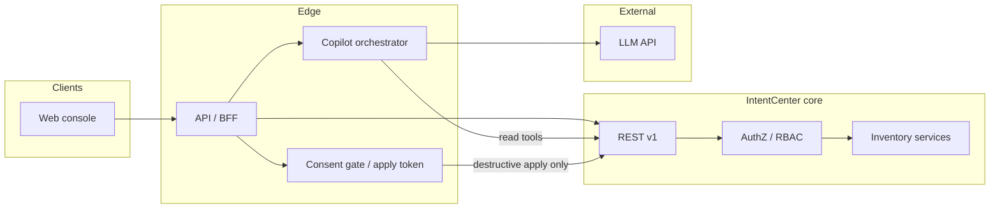
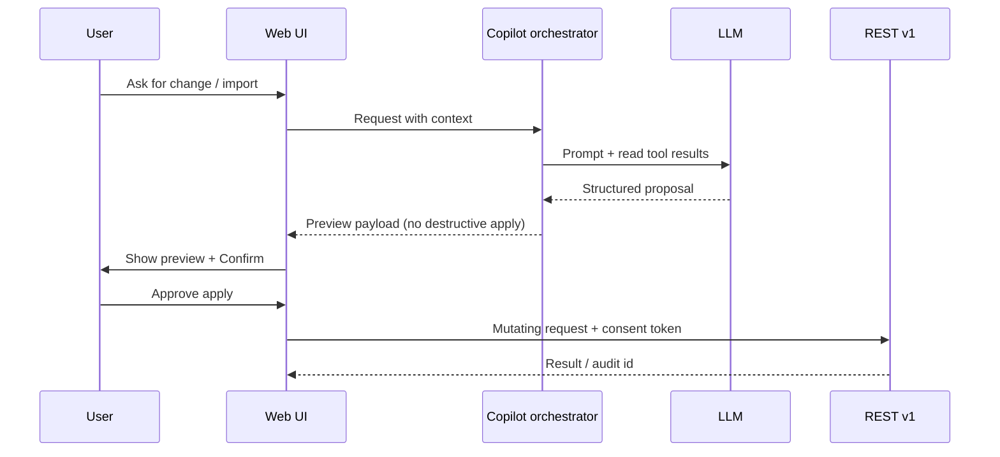

# Design: LLM-assisted operations (IntentCenter)

**Status:** Draft  
**Last updated:** 2026-04-29  
**Related:** [Architecture & design visuals](architecture.md), [Platform README](../platform/README.md), [User & sign-in (env vs admin UI)](design-auth-user-management.md)

---

## 0. Non-negotiable: preview and permission for destructive work

**Requirement:** Whenever the assistant workflow would perform a **destructive** change (see §5.5), the product **must**:

1. **Show a preview** of the exact change set before any mutating API call runs—human-readable summary plus structured detail (objects, operations, field deltas, bulk row counts, replace vs append semantics).
2. **Obtain explicit permission** from the user to proceed (a deliberate confirmation control—not navigation alone, not implied consent from the chat turn).
3. **Execute only after** that confirmation; a single chat message or model output must **not** apply destructive changes automatically.

**Server-side enforcement:** The orchestrator **must not** invoke mutating endpoints for destructive operations unless the request carries a **valid consent artifact** for that specific preview (e.g. short-lived, signed **apply token** bound to user, tenant, payload hash, and expiry). The LLM must never receive credentials or bypass this gate.

Non-destructive creates/updates may follow the same preview pattern for consistency; **destructive** paths are mandatory.

---

## 1. Summary

This document specifies an **LLM-assisted layer** on IntentCenter: grounded answers, draft change bundles, and import/reconciliation help—without making the model a second source of truth. The assistant **reads** inventory and policy through existing APIs (and future tool endpoints), **proposes** structured actions, and **applies changes** only through the same paths as human operators—with **audit**, **RBAC**, and—for **any destructive operation**—a **mandatory preview and explicit user permission** (§0) before execution.

---

## 2. Goals

| Goal | User-visible outcome |
|------|----------------------|
| **Throughput** | Faster path from natural-language intent to validated API payloads, bulk mappings, and runbooks. |
| **Trust** | Answers cite inventory objects and links; “unknown” is explicit when data is missing. |
| **Safety** | No silent database writes; **destructive actions always show a preview and require explicit confirmation** before apply (§0). |
| **Operability** | Observable, rate-limited, tenant-scoped usage suitable for production NetOps/DCIM teams. |

---

## 3. Non-goals (initial phases)

- Replacing deterministic policy engines, validation rules, or compliance checks with model judgment.
- **Unrestricted** autonomous remediation in production (no “fix it” without preview + permission for destructive work, per §0).
- Training a bespoke foundation model; **inference via hosted or self-hosted APIs** is assumed unless a later phase requires otherwise.
- Storing object embeddings or vectors **without** the **administered** controls, isolation, and retention in **§17** (RAG and embeddings are in scope, but not as an ungoverned side channel).

---

## 4. Personas and primary scenarios

| Persona | Scenario | Assistant role |
|---------|----------|------------------|
| **NetOps / NOC** | “What depends on this device?” / incident context | Retrieve related objects via search + resource graph; summarize with citations. |
| **DCIM / field** | Plan a rack or maintenance window | Draft a **change bundle**; user reviews **preview**, then **confirms** before any destructive apply. |
| **Automation engineer** | Encode a recurring procedure | Draft structured steps, variables, and guardrails for jobs/plugins (human edits). |
| **Data steward** | Reconcile vendor export to inventory | Propose mapping + **import preview**; **confirm** before bulk import runs (destructive if overwrite/replace). |
| **New operator** | Learn object model in context | Explain **this** record and links using retrieved fields, not generic DCIM lecture. |

---

## 5. Functional requirements

### 5.1 Grounded Q&A (read path)

- Accept user questions with optional **page context** (current `resourceType`, `id`, route).
- Retrieve evidence using server-side tools: at minimum **`GET /v1/search`**, **`GET /v1/resource-view/{resourceType}/{id}`**, **`GET /v1/resource-graph/{resourceType}/{id}`** (see [platform README](../platform/README.md)). When **RAG** is enabled for the org, **add** top-k **semantic** hits (docs and allowed object chunks, **§17**) to the model context, combined with—never in place of—tool results.
- Respond with **short answer + citations** (object type, id, display fields, deep link path pattern).
- If evidence is insufficient, say so and suggest **specific** follow-up queries or UI navigation—not invented IDs.

### 5.2 Change assistance (write path, proposal-first)

- From natural language or structured selection, produce a **machine-readable proposal**: list of operations (create/update/archive/delete), target ids, field deltas, and dependency notes.
- The UI **always** renders a **Change preview** (diff/table, affected object count, operation types) before any apply.
- **If the proposal is destructive** (§5.5): the user **must** review the preview and trigger an explicit **Approve / Apply** (or equivalent) action. Until then, **no** mutating API calls for that proposal.
- Execution uses **existing mutating APIs** (not direct SQL or hidden ORM bypass), only after consent when required (§0).
- Respect **RBAC**: proposals are generated with the **same user identity** as the session; attempted operations beyond permission fail at execution with clear errors.

### 5.3 Bulk import assistance

- Input: sample rows + target `resourceType` (or “infer” with confirmation).
- Output: suggested **CSV column mapping**, type coercion notes, row-level or aggregate **validation warnings**, and an **import preview** (e.g. first N rows resolved, counts of creates/updates/archives, overwrite scope).
- **Destructive imports** (e.g. replace semantics, mass update, delete/archive via import): **mandatory preview + explicit permission** before `POST /v1/bulk/{resourceType}/import/csv` (or JSON import). Non-destructive trial imports may still use preview-by-default for consistency.
- Optional: small batch **dry-run** using existing validation endpoints if/when exposed; dry-run results feed the same preview surface.

### 5.4 Incident / ticket assist (optional phase)

- Parse pasted ticket text; extract candidate hostnames, IPs, circuit ids; resolve via search; return **linked inventory summary** for triage. If this flow ever suggests mutations, **§0** applies.

### 5.5 Classification: destructive operations

The platform **must** treat at least the following as **destructive** (preview + explicit permission required before execution):

| Category | Examples (product terminology may vary) |
|----------|----------------------------------------|
| **Delete / remove** | Hard delete, permanent removal from inventory |
| **Archive / soft retire** | Operations that remove objects from active use or break dependencies |
| **Bulk overwrite** | Import or sync that **replaces** existing rows, clears fields, or applies “full replace” semantics |
| **Destructive bulk** | Mass archive/delete, or imports above a configured row threshold without dry-run approval |
| **Irreversible automation** | Job or plugin execution that the policy engine classifies as destructive (if/when integrated) |

**Product rule:** When in doubt, classify as destructive and require preview + consent. **Creates** and **non-destructive updates** may still use the same preview UX for consistency, but **§0** is strictly required for rows in the table above.

---

## 6. System architecture

High-level placement: a **Copilot service** (or module inside the API boundary) sits behind the **API gateway / BFF**, calls the **LLM provider**, and invokes **tools** that wrap existing IntentCenter APIs. The **core domain** and **workers** remain authoritative for state changes. **Destructive mutations** pass through a **consent gate** the LLM cannot bypass.

**Orchestration pattern:** the copilot runs a **tool-calling** loop: model requests tools → server executes **read** tools with user token → results returned to model → final user-facing message with citations. **Mutating tools** for destructive operations are **not** callable from the model path alone: the server returns a **preview payload** to the UI; only the user’s **Apply** action (with **consent token**, §0) may invoke the mutating API. **All tool calls are logged** (see §9).

---

## 7. Tooling contract (server-side)

### 7.1 Read tools (model-invokable)

Minimum tool set for v1:

| Tool | Purpose | Backing API |
|------|---------|-------------|
| `search` | Find objects by query | `GET /v1/search?q=&limit=` |
| `get_resource_view` | Fields + graph payload for UI parity | `GET /v1/resource-view/{resourceType}/{id}` |
| `get_resource_graph` | Relationship JSON only | `GET /v1/resource-graph/{resourceType}/{id}` |

### 7.2 Write and destructive paths (not model-direct)

| Path | Behavior |
|------|----------|
| **Proposal generation** | Model or orchestrator outputs a **structured proposal**; **no** side effects on inventory. |
| **Destructive apply** | Invoked only from **client** (or server **apply** handler) after preview + consent token validation—not as a normal LLM tool. |
| **Optional `build_preview`** | Server-side helper that turns a proposal into canonical preview JSON for the UI; still no mutations. |

Future tools (as APIs exist or are added):

- Scoped **mutation preview** (dry-run) if the platform exposes it.
- **Policy explain**: deterministic output from policy engine, wrapped for the model to paraphrase.
- **Automation/job** template expansion for extension packages (draft only until user runs job with same preview/consent rules if destructive).

**Rules:**

- Tools execute **with the caller’s credentials** (no service-wide superuser for customer data).
- **The LLM must not** be given a tool that performs destructive mutations without the consent gate.
- **Idempotency keys** on mutating calls where the platform supports them.
- Hard **limits** on tool calls per user message and per session (cost and abuse control).

---

## 8. Security, privacy, and compliance

- **Data minimization:** send the LLM only fields needed for the task; optionally **redact** secrets (e.g. API keys, credentials) via server-side scrubbing before model calls.
- **Residency:** if using a third-party LLM, document **what leaves the boundary** (prompt, retrieved records, metadata). Offer **region pinning** and **enterprise VPC / private endpoint** options for regulated customers.
- **Retention:** configure whether prompts/responses are **not stored**, **stored encrypted with TTL**, or **opt-in** for quality review.
- **Prompt injection:** treat retrieved inventory text as **untrusted content**; system prompts instruct the model not to follow instructions embedded in records; strip or escape where feasible.
- **Audit:** log copilot sessions with `user_id`, `tenant`, tool names, object ids touched, **preview id / payload hash**, **consent granted** (timestamp + control surface), and **mutation outcome**. Destructive applies must be reconstructible for compliance reviews.

---

## 9. Observability

- Metrics: request latency, tokens in/out, tool error rate, rate-limit hits, user satisfaction feedback (optional thumbs).
- Tracing: one trace span per copilot request; child spans per tool call (align with product tracing strategy).
- Errors: surface user-safe messages; log provider errors server-side (no raw secrets).

---

## 10. UX surfaces (web)

Suggested placement (implementation detail can vary):

1. **Global assistant** entry in shell (sidebar or header)—always available; prefers **current page context** when open from an object view.
2. **Contextual actions** on list/detail pages: “Explain links,” “Draft update from description,” “Map import columns.”
3. **Change preview (mandatory for destructive work):** a dedicated panel or modal showing **what will happen** (object list, operation per row, before/after or field deltas, import row counts and modes). **Primary action** is **Review**; **Apply** / **Run import** is secondary and only enabled after the user has seen the preview (no one-click destructive apply from chat).
4. **Explicit permission:** checkbox or typed confirmation for **high-impact** classes (configurable), e.g. “Type DELETE to confirm” or “I understand N objects will be archived.”
5. **Post-apply:** link to audit trail / object history; clear success or partial-failure summary.

**Empty and error states:** offline provider, rate limit, or permission denial must be clear and actionable. If the user closes the preview without applying, **no** destructive call occurs.

---

## 11. Phased delivery

| Phase | Scope | Exit criteria |
|-------|--------|----------------|
| **P0** | Grounded Q&A with `search` + `resource-view` / `resource-graph`; citations; no writes | Pilot users answer real questions with acceptable hallucination rate (measured by spot checks). |
| **P1** | Change **proposals** + **mandatory preview + consent** for destructive ops; execute via existing REST with full RBAC + apply token | Users can complete a destructive workflow only via preview → confirm; integration tests prove no apply without token. |
| **P2** | Bulk import mapping assistant + **same preview/consent** for destructive imports | Destructive imports cannot run without preview panel + confirmation. |
| **P3** | Ticket paste + correlation; optional policy/risk narration | Agreed triage workflow adopted by one team. |

---

## 12. Success metrics

- **Time to answer** for common inventory questions vs. manual navigation (sample tasks).
- **Proposal acceptance rate:** % of LLM-drafted bundles executed without major edit.
- **Import mapping:** edits required before successful bulk import (median).
- **Safety:** zero **unauthorized** or **un-previewed destructive** mutations attributable to copilot (must remain zero by design: consent gate + tests); incidents reviewed within SLA.

---

## 13. Risks and mitigations

| Risk | Mitigation |
|------|------------|
| Hallucinated IDs or relationships | Citations required; tool-only facts for claims about specific objects; refuse when retrieval is empty. |
| Prompt injection via field values | Untrusted content handling; minimal exfiltration surface; avoid over-privileged tools. |
| User misled into approving a harmful change | Preview shows **server-built** canonical payload (hash-bound consent token), not model-authored “trust me” text; optional typed confirm for high-impact operations (§10). |
| Cost spikes | Per-user, org, and global budgets; **RAG/embedding** costs in **§17**; summarization of large graphs before model. |
| Regulatory pushback on cloud LLM | Private deployment option; data processing agreement; clear data flow doc. |

---

## 14. Admin LLM configuration and provider abstraction

**Goal:** Operators configure **per-organization** LLM client settings (chat/completions provider, defaults, and budgets) used by IntentCenter Copilot, automation draft flows, and **server-mediated** extension hooks. **Environment variables** can override org-stored config for a given process (e.g. lockdown or central ops); when override applies, the same **UI lock and masking** rules as below apply. Configuration otherwise follows the same **environment overrides UI** pattern as sign-in and identity (see [design-auth-user-management.md](design-auth-user-management.md)):

- If a setting is present in **environment** for the running process, it **wins** for runtime; the corresponding **admin UI is disabled** (or read-only) with a clear message (e.g. *Settings configured at the environment level cannot be changed within the interface*).
- **Non-secret** values may be shown read-only in the admin panel when env-defined.
- **Secrets** (API keys, client secrets) are **never** returned in plaintext to the browser: show **obfuscated** placeholders (e.g. `****last4` or `••••••••`) when the value is known to exist, whether from env or from encrypted DB storage.
- **Database-stored** secrets (when env is not set) are encrypted at rest (same class of mechanism as IdP secrets) and only usable server-side inside the copilot and provider clients.

**Server-only:** API keys and all inference traffic stay **behind the API**; the web app never holds provider credentials.

### 14.1 Provider families (pluggable adapters)

The orchestrator should depend on a small **inference port** (e.g. `complete`, `stream`, `embed` if needed later) implemented per backend. **OpenAI Chat Completions–compatible** HTTP (custom `baseUrl` + `apiKey` + `model`) is the **default** adapter and covers a wide range of deployments:

| Kind | Typical use | Notes |
|------|-------------|--------|
| **OpenAI-compatible HTTP** | OpenAI, many gateways, self-hosted (vLLM, Ollama compat, LiteLLM proxy) | One adapter; `baseUrl` may point to **Azure OpenAI** resource if the path is compatible, or a **Cloudflare AI Gateway** / reverse proxy. |
| **Azure OpenAI (first-party)** | Enterprise Azure | Often needs **resource name**, **deployment name**, `api-version`, and Azure AD or key—may use a **dedicated** adapter if the REST shape differs from generic compat mode. |
| **Anthropic Messages API** | Claude | Native adapter; not OpenAI-shaped; map system/tools in the orchestrator. |
| **Amazon Bedrock** | AWS managed models | Adapter via **IAM / instance role** or access keys; model id + region. |
| **Cloudflare** | **Workers AI** (binding) or **AI Gateway** (routed OpenAI/Llama endpoints) | Workers AI is **platform-specific**; AI Gateway is often best exposed as **OpenAI-compatible** HTTP to the generic adapter. |

**Product principle:** Favor **one** generic HTTP adapter plus **targeted** first-party adapters where the public API is not OpenAI-compatible. Avoid N bespoke HTTP clients; centralize retries, logging, and redaction.

### 14.2 Suggested environment variable names (illustrative)

Names should be namespaced and documented in `platform/.env.example` (mirroring `AUTH_*`). Examples:

- `LLM_ENABLED`, `LLM_PROVIDER` (e.g. `openai_compat` | `azure_openai` | `anthropic` | `bedrock` | `cloudflare_*`)
- `LLM_BASE_URL`, `LLM_API_KEY` (sensitive)
- `LLM_DEFAULT_MODEL`, `LLM_MAX_OUTPUT_TOKENS` (safety / cost caps)
- Optional: `LLM_AZURE_RESOURCE`, `LLM_AZURE_DEPLOYMENT`, `LLM_BEDROCK_REGION`, etc.

**Admin API:** e.g. `GET/PATCH /v1/admin/llm` (or org-scoped variant, names TBD) with `require_admin`, org context from session, returning **effective** config with **lock flags** per field (`source: "env" | "database"` and `locked: true` when env wins) so the UI can disable inputs and show masks. **No global-only single-tenant** requirement for product direction: org admin owns primary settings; **large customers** may additionally run a **dedicated copilot/embedding stack** (see **§16**), still governed by the same in-product **§0** and audit rules.

---

## 15. Additional capabilities, extensions, and schema-aware read tools

### 15.1 What else the assistant can do (non-exhaustive)

Beyond grounded Q&A and change proposals, the same **orchestrator + model** (subject to the same RBAC, audit, and §0 consent rules) can support:

- **Runbook and procedure drafting** from a described outcome (steps, variables, rollbacks) without executing destructive automation until a human or policy runs it.
- **Natural language → saved filters and views** (outputs structured filter JSON validated against the API, not ad hoc SQL in the client).
- **Schema and “how do I model X?”** answers using **approved** metadata (see §15.2)—grounded in real types and relationships, not the model’s prior only.
- **Import/reconciliation refinement** (already in scope in §5.3): extended to multi-file diff narratives and **validation error clustering**.
- **Incident and change narration**: summarize impact from **retrieved** graph and ticket extracts (see §5.4).
- **Policy and risk phrasing** that **paraphrases** deterministic engine output (the engine remains authoritative).
- **Operator onboarding**: in-context tours tied to the **current** resource type and route.
- **Batch “explain my selection”** across N objects with citation caps and summarization to control tokens.

### 15.2 Database and schema access (read-only, server-mediated)

The model **must not** receive raw connection strings or arbitrary SQL. Instead, add **read tools** that the server implements with full **RBAC**, **parameterization**, and **row limits**:

| Tool (concept) | Purpose |
|----------------|---------|
| `get_resource_model` / `list_resource_types` | Document the **public** object model: which `resourceType` values exist, key fields, relationship names—backed by generated schema or stable metadata (not ad hoc DB introspection unless locked down). |
| `describe_fields` / `get_enum_values` | Field-level help aligned with the REST and UI. |
| `search` / `get_resource_view` / `get_resource_graph` | (Existing §7.1) **Authoritative** inventory reads. |
| `aggregate_stats` (optional) | **Parameterized** rollups the product explicitly supports (counts by site, by type) via SQL or service layer—never free-form `SELECT`. |

**Destructive or bulk writes** remain behind §0: never exposed as a model tool.

### 15.3 Plugins and extensions

**Extensions** (jobs, custom modules, marketplace packages—per product roadmap) should **not** hold provider API keys. They receive access to the **same** managed inference by calling **platform APIs** (e.g. *internal* `POST /v1/internal/llm/complete` or a worker RPC) with:

- **Service identity** or **user-delegated** scoping; short-lived tokens; a **shared org-level** inference and embedding **quota** (and global safety caps), not a separate per-extension token budget unless a future product adds that.
- A **fixed tool allowlist** (or no tools) for extension use cases, distinct from the full copilot toolset where appropriate.
- **Audit** of extension id, tenant, and request metadata.

This keeps one **billing, safety, and observability** story and avoids N extensions shipping their own OpenAI clients.

---

## 16. Resolved product decisions (formerly open questions)

| Topic | Decision |
|-------|----------|
| **Embeddings / RAG** | **Docs + in-product help** and **object embeddings** (inventory-aware retrieval). The product must expose **admin settings, env overrides, pipeline behavior, and storage/retention** in **§17**—not an unmanaged parallel index. |
| **Multi-tenant / deployment** | Default: **org-scoped** data and config in a **shared** deployment. **Large customers** may use **dedicated per-tenant instances** (infrastructure isolation); **§0**, RBAC, and audit still apply. |
| **ITSM / change tools** | **Yes:** integrate with external **ITSM/change** systems where roadmap allows. **In-product** preview and explicit permission (§0) **remain mandatory**; external systems may **add** a gating or evidence step, not replace in-product consent unless an explicit, auditable org policy authorizes a narrow exception. |
| **Languages** | **English only** for v1: operator-facing assistant UI copy, system prompts, and default model instructions. (Localization can be revisited when requirements exist.) |
| **LLM settings scope** | **Per organization** in the database; process-level **env** can override/lock the same way as other admin categories. |
| **Extension inference** | **Shared** org-level quota and caps for LLM/embedding use (one pool for copilot, extensions, and background jobs, subject to global rate limits and abuse control). **Which surfaces** get tool-using vs text-only completion is allowlisted in code/product policy, not a separate per-extension token budget in v1. |

---

## 17. Embeddings, RAG, and vector retrieval

**Purpose:** Complement **tool-based** facts (§7) with **semantic** retrieval over **(a)** static/docs + help and **(b)** **curated, redacted** text from inventory objects, so the assistant can answer “what is like X?” and fuzzy questions without the model fabricating object IDs. **RAG** feeds **read path** and proposal **drafting** context; **it does not replace** tools for authoritative current state, **§0** for writes, or RBAC.

### 17.1 Admin and environment controls (per org)

Per **§14** and **§16**: settings are **per organization**, with the same **env-wins, lock UI, show non-secrets read-only, mask secrets** contract.

| Area | Examples (illustrative names; see `.env.example` when implemented) |
|------|--------|
| **Flags** | `RAG_ENABLED`, `RAG_DOCS_ENABLED`, `RAG_OBJECTS_ENABLED` (or nested JSON in org config). When env sets a flag, UI for that field is read-only. |
| **Models** | Embedding model id, provider adapter (often **same** vendor family as chat, or a dedicated small embedding model); **dimension** and whether to normalize vectors (must match index schema). |
| **Scope** | **Doc/help:** which collections or site paths. **Objects:** which `resourceType`(s) and which **field groups** (name, description, tags, custom string fields—**never** credentials or PII not approved for model egress). |
| **Limits** | **Max chunk count** per object, **max** stored bytes per org, **top-k** at query time, **re-embed** cooldown, **backfill** batch size. |
| **Retention** | **TTL** for vector rows, **delete** vectors when source object removed (eventual consistency acceptable with documented SLA). |
| **Regions / residency** | If the product supports it: **pin** embedding and vector storage to a **region** for compliance. |

**Admin API:** e.g. `GET/PATCH /v1/admin/rag` (with org scope) returning **effective** values + per-field `source` / `locked` for the UI. Obfuscate or omit secrets (API keys) as in **§14**.

### 17.2 Index storage and isolation

- **Namespace per organization** in the vector store; **no** cross-tenant knn in one query. Large customers on **dedicated** stacks (**§16**) get physical isolation as their deployment model requires.
- **Back end:** product choice of **pgvector** (co-locate with app DB for simpler ops) vs external vector service—must support **backups, restore**, and **GDPR/retention** (delete on org removal / legal hold as policy dictates).
- **Idempotency:** each chunk has stable keys `(orgId, sourceType, sourceId, chunkId, embeddingSchemaVersion)`.

### 17.3 Pipeline: how embeddings are produced and refreshed

- **Ingestion:** for **object** sources, a **work queue** (or outbox) drives embedding jobs: on **create/updates** to included fields, enqueue **re-embed**; on **delete**, enqueue **tombstone** (remove points). For **docs/help**, **publish** or **ingest** jobs run on build/deploy or on admin-triggered reindex.
- **Chunking:** deterministic, documented strategy (e.g. max tokens per chunk, split on headings for Markdown). **Store** `chunk_text` or only the vector, depending on privacy/audit—if text is not stored, retain enough to recompute or to cite **resource ids** in answers.
- **Versioning:** bump **`embeddingSchemaVersion`** when the embedding model, chunking, or field mask changes; **re-backfill** org or global in controlled batches.
- **Scheduler:** background workers with **concurrency** limits, **per-org** back-pressure, and **dead letter** behavior on repeated failures. **Metrics:** queue depth, success rate, lag from object update to “searchable”.

### 17.4 Query path (RAG in the copilot)

- User question → (optional) **query embedding** with org’s **embedding** config → **similarity** search in org index (top-k, score threshold) → **merge** with **tool** results (`search`, `get_resource_view`, etc.) in the **orchestrator** → model receives a **capped** context bundle and must **cite** sources.
- **Prompt injection** mitigations in **§8** apply to **all** embedded text. **RAG** results are **untrusted** content; tools remain authoritative for facts about live inventory.

### 17.5 Observability and cost

- Emit metrics: **embeds/sec**, **reindex** backlog, **index size** per org, **query** latency, **RAG** hit rate, **stale** chunk age. Tie **spend** to the **shared org** quota in **§16** for both chat and embed calls.

---

## 18. Document history

| Date | Change |
|------|--------|
| 2026-04-20 | Initial draft |
| 2026-04-20 | Mandatory preview + explicit permission for destructive operations; consent gate, §5.5 classification, tooling/UX/architecture updates |
| 2026-04-29 | Admin LLM (per-org, env lock, providers), extension + schema tools, **§16** decisions, **§17** embeddings/RAG (admin, pipeline, storage, query, metrics). Updates to **§3/§5.1/§13/§14/§15.3**. |
